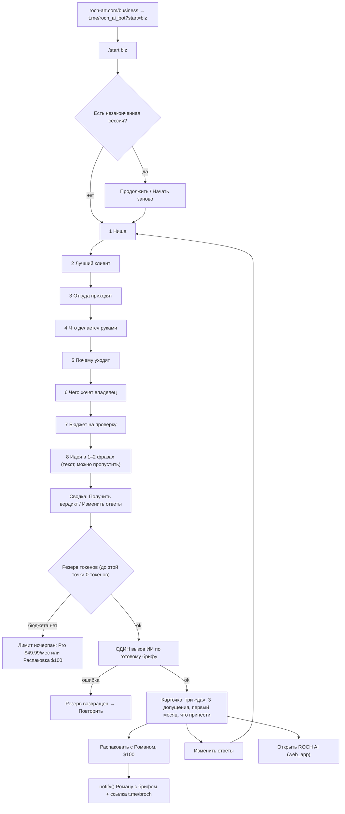

# ROCH AI: скриптовый вход для бизнеса

> **Статус: предложение, не внедрено.** Код бота лежит не в этом репозитории, а в `/Users/roch/code/roch-ai`
> (Next.js 15.5, `basePath /rochai`, Supabase, `@anthropic-ai/sdk` 0.68.0). Здесь только спецификация.
> Миграции применять только после «ок» Романа.
> Методика, в которую встраивается бот, описана в [`conveyor.md`](./conveyor.md). Номера Q1–Q12 взяты оттуда.

---

## 0. Что есть сейчас (сверено с кодом 30.09.2026)

| Что | Где | Факт |
|---|---|---|
| Webhook | `app/api/tma/webhook/route.ts` (live `/rochai/api/tma/webhook`) | Порядок обработки: `pre_checkout_query` :24 → `callback_query` :30–37 (понимает только `^star:(\d+)$`, но отвечает на любой callback и делает return) → `successful_payment` :46 → `/start` :87 (из payload понимает только `ref_?(\d{3,})` :90, иначе приветствие с одной `web_app`-кнопкой :98–100) → всё прочее игнорируется :105. `maxDuration` не задан |
| Telegram | `lib/telegram.ts` | `tgCall` :16, `sendTo` :27, `sendPhotoTo` :46, `validateInitData` :69, `notify` (ops-чат Романа) :89, `createStarsInvoice` (XTR) :100 |
| ИИ | `app/api/generate/route.ts` | `ROCH_MODEL` :54 (по умолчанию `claude-sonnet-5`), `ROCH_AUDIT_MODEL` :57. Каждый вызов single-turn, без истории на сервере. Adaptive thinking включён через `as any` :260, потому что SDK 0.68 не знает этот тип |
| Промпты | `lib/systemPrompt.ts` | `ROCH_VOICE` :6, `ROCH_DESIGN` :16, `ROCH_PROJECT_PROMPT` :61, `ROCH_SYSTEM_PROMPT` :110, `ROCH_CODE_PROMPT` :184 |
| Лимиты | `lib/store.ts:16`, `supabase/migrations/0001_roch_ai_quota.sql` | Лимит считается в разборах: 1 токен = 1 разбор. `FREE_START = 3`. Таблица `roch_ai_users`. `roch_spend` :35 (отказы `rate` и `no_tokens`, не больше 20 за 24 ч), `roch_refund` :79. Обёртки в `lib/quota.ts`: `spend` :47, `refund` :49, `state` :55 |
| Оплата | `lib/pricing.ts`, миграция `0003` | pack10 $9.99 / 500⭐, pack50 $29.99 / 1500⭐, SUB pro $49.99 / 30 дней / 2500⭐. Инвойс подписки: `app/api/tma/invoice/route.ts:25`, payload `{uid, kind:"sub", days}` |
| Лид «Рома лично» | `app/api/tma/lead/route.ts` | Только пингует Романа, ничего не сохраняет |
| Чего нет | — | Таблиц брифов, лидов и сессий. Скриптового флоу и state machine. Аналитики. `zod` |
| Сайт | `business.html` | Ведёт на `t.me/roch_ai_bot?start=biz`. Telegram Романа на сайте: **@broch** |

---

## 1. Цель и поток

**Цель:** за 2–3 минуты собрать бриф кнопками, не потратив ни одного токена. Затем **одним** вызовом ИИ
по готовому брифу дать честный предварительный вердикт по «трём да» и довести человека до распаковки за $100.

**Принципы**
1. Сначала скрипт, потом ИИ. До кнопки «Получить вердикт» LLM не вызывается.
2. ИИ здесь не собеседник. Вызов один, single-turn, как и остальные вызовы в roch-ai.
3. Главный актив — бриф. Он сохраняется и уходит Роману вместе с заявкой.
4. Вердикт выносит сервер по правилу «три да», модель даёт только оценки по каждому «да».



---

## 2. Вопросы-кнопки

**Общие правила**
- Все шаги живут в одном сообщении: переход между шагами делаем через `editMessageText` (вызывается через `tgCall`), чат не засоряется.
- В сообщении есть счётчик `3/8`, по две кнопки в ряд, в последнем ряду «← Назад» (кроме шага 1).
- Метки кнопок не длиннее 24 символов. Единственное исключение — CTA «Распаковать с Романом, $100» (27 символов): она стоит одна на всю ширину ряда.
- Формат `callback_data`: `iq:<rev>:<step>:<val>`, только ASCII. `rev` — ревизия сессии в base36. Самый длинный вариант, `iq:zzzz:budget:2500_5000`, занимает 24 байта при лимите 64.
- Служебные callback'и: `iq:<rev>:back:0`, `iq:<rev>:skip:idea`, `iq:<rev>:go:1`, `iq:<rev>:edit:0`, `iq:<rev>:call:1`, `iq:<rev>:sub:1`, `iq:<rev>:resume:0`, `iq:<rev>:restart:0`.

| # · step | Текст вопроса | Кнопки: «метка» → `val` | Блок · Q |
|---|---|---|---|
| 1 · `biz` | Какой у вас бизнес? | «Салон / бьюти» `salon` · «Клиника» `clinic` · «Туризм / отель» `tour` · «Детский центр» `kids` · «Магазин» `shop` · «Производство» `mfg` · «Другое» `other` | контекст |
| 2 · `best` | Кто ваш лучший клиент? | «Ходит регулярно» `regular` · «Покупает редко, но много» `bigrare` · «Приходит семьёй» `family` · «Компании (B2B)» `b2b` · «Туристы, разово» `oneoff` · «Другое» `other` | Клиент · Q1 |
| 3 · `chan` | Откуда он к вам приходит? | «Сарафан, рекомендации» `word` · «Соцсети» `social` · «Карты и отзывы» `maps` · «Реклама» `ads` · «Проходят мимо» `walk` · «Партнёры, агенты» `partners` · «Другое» `other` | Клиент · Q1 |
| 4 · `hand` | Что вы сейчас делаете руками? | «Запись и напоминания» `booking` · «Ответы в мессенджерах» `chat` · «Учёт в таблицах» `sheets` · «Бонусы и скидки» `loyalty` · «Приём заказов» `orders` · «Отчёты владельцу» `reports` · «Другое» `other` | Клиент · Q2 |
| 5 · `churn` | Почему клиенты уходят? | «Забывают вернуться» `forget` · «Уходят к конкурентам» `compet` · «Дорого» `price` · «Неудобно записаться» `friction` · «Услуга разовая» `oneoff` · «Не знаю» `unknown` · «Другое» `other` | Клиент · Q3 |
| 6 · `goal` | Чего вы хотите от приложения? | «Чаще возвращались» `return` · «Записывались сами» `selfbook` · «Приводили друзей» `referral` · «Больше средний чек» `aov` · «Меньше ручной работы» `ops` · «Выделиться на рынке» `brand` · «Другое» `other` | Петля · Q4–Q6 (частично) |
| 7 · `budget` | Сколько готовы вложить в проверку идеи? | «До $100» `lt100` · «$100–500» `100_500` · «$500–2 500» `500_2500` · «$2 500–5 000» `2500_5000` · «Больше $5 000» `gt5000` · «Пока не готов» `none` | Деньги · Q9 |
| 8 · `idea` | Опишите идею в 1–2 фразах. Без личных данных клиентов. | Ответ текстом, до 500 символов · «Пропустить →» `skip:idea` | Q4/Q10 (частично) |
| — · `confirm` | Сводка ответов списком | «Получить вердикт» `go:1` · «Изменить ответы» `edit:0` | — |

Диапазоны бюджета повторяют цены лестницы: $100 — распаковка, $500 — Style Core, $2 500 — Full Build, $5 000 — Game Layer.

**Как обрабатываем «Другое».** Сохраняем значение `other` и **не просим уточнять текстом**: единственный текстовый ввод во флоу — шаг 8.
Если в ответах есть хотя бы одно `other`, в шаге 8 появляется подсказка: «Уточните здесь, что вы имели в виду под „Другое“».
В промпте ИИ `other` означает «не из списка». Пункты с `other` попадают в `coverage.partial` и в список «что принести на звонок».

---

## 3. Бриф: JSON Schema (draft 2020-12)

Бриф собирает сервер, без участия ИИ. Блоки совпадают с блоками конвейера. Про Запуск (Q10–Q12) бот
не спрашивает: эти поля остаются `null`, попадают в `coverage.gaps` и закрываются на распаковке.

```json
{
  "$schema": "https://json-schema.org/draft/2020-12/schema",
  "$id": "urn:roch:intake-brief:v1",
  "title": "ROCH AI · бриф бизнеса (скриптовый вход)",
  "type": "object",
  "additionalProperties": false,
  "required": ["schema_version", "brief_id", "tg_id", "entry", "lang", "created_at",
               "business", "client", "loop", "money", "launch", "coverage"],
  "properties": {
    "schema_version": { "const": "1.0" },
    "brief_id": { "type": "string", "pattern": "^BRF-[0-9A-Z]{6}$" },
    "tg_id": { "type": "integer" },
    "entry": { "enum": ["biz"] },
    "lang": { "enum": ["ru", "en"] },
    "created_at": { "type": "string", "format": "date-time" },
    "business": {
      "type": "object", "additionalProperties": false, "required": ["type", "idea_text"],
      "properties": {
        "type": { "enum": ["salon", "clinic", "tour", "kids", "shop", "mfg", "other"] },
        "idea_text": { "type": ["string", "null"], "maxLength": 500 }
      }
    },
    "client": {
      "$comment": "Блок «Клиент» · Q1–Q3",
      "type": "object", "additionalProperties": false, "required": ["best", "channel", "manual", "churn"],
      "properties": {
        "best":    { "enum": ["regular", "bigrare", "family", "b2b", "oneoff", "other"] },
        "channel": { "enum": ["word", "social", "maps", "ads", "walk", "partners", "other"] },
        "manual":  { "enum": ["booking", "chat", "sheets", "loyalty", "orders", "reports", "other"] },
        "churn":   { "enum": ["forget", "compet", "price", "friction", "oneoff", "unknown", "other"] }
      }
    },
    "loop": {
      "$comment": "Блок «Петля» · Q4–Q6, бот знает только цель владельца",
      "type": "object", "additionalProperties": false, "required": ["owner_goal"],
      "properties": { "owner_goal": { "enum": ["return", "selfbook", "referral", "aov", "ops", "brand", "other"] } }
    },
    "money": {
      "$comment": "Блок «Деньги» · Q9 из бота, Q7–Q8 закрываются на звонке",
      "type": "object", "additionalProperties": false, "required": ["validation_budget"],
      "properties": { "validation_budget": { "enum": ["lt100", "100_500", "500_2500", "2500_5000", "gt5000", "none"] } }
    },
    "launch": {
      "$comment": "Блок «Запуск» · Q10–Q12, бот не спрашивает",
      "type": "object", "additionalProperties": false, "required": ["first_scenario", "team_user", "success_30d"],
      "properties": {
        "first_scenario": { "type": ["string", "null"] },
        "team_user": { "type": ["string", "null"] },
        "success_30d": { "type": ["string", "null"] }
      }
    },
    "coverage": {
      "type": "object", "additionalProperties": false, "required": ["answered", "partial", "gaps"],
      "properties": {
        "answered": { "type": "array", "items": { "pattern": "^Q([1-9]|1[0-2])$" }, "uniqueItems": true },
        "partial":  { "type": "array", "items": { "pattern": "^Q([1-9]|1[0-2])$" }, "uniqueItems": true },
        "gaps":     { "type": "array", "items": { "pattern": "^Q([1-9]|1[0-2])$" }, "uniqueItems": true }
      }
    }
  }
}
```

**Как считается `coverage`:** `best` и `chan` закрывают Q1, `hand` — Q2, `churn` — Q3 (кроме ответа `unknown`, тогда Q3 partial), `budget` — Q9 (кроме `none`, тогда partial).
`goal` частично закрывает Q5 (`return`), Q4 (`selfbook`, `ops`) или Q6 (`referral`). Непустой `idea_text` частично закрывает Q10. Всё остальное попадает в `gaps`.

**Пример** (данные вымышленные, только для формы):

```json
{
  "schema_version": "1.0",
  "brief_id": "BRF-EXAMP1",
  "tg_id": 100000001,
  "entry": "biz",
  "lang": "ru",
  "created_at": "2026-01-01T00:00:00Z",
  "business": { "type": "salon", "idea_text": "[ПРИМЕР] Хочу, чтобы клиенты записывались сами и копили баллы" },
  "client": { "best": "regular", "channel": "word", "manual": "booking", "churn": "forget" },
  "loop": { "owner_goal": "return" },
  "money": { "validation_budget": "500_2500" },
  "launch": { "first_scenario": null, "team_user": null, "success_30d": null },
  "coverage": { "answered": ["Q1", "Q2", "Q3", "Q9"], "partial": ["Q5", "Q10"],
                "gaps": ["Q4", "Q6", "Q7", "Q8", "Q11", "Q12"] }
}
```

---

## 4. Один вызов ИИ

| Параметр | Значение | Почему |
|---|---|---|
| `model` | `process.env.ROCH_MODEL \|\| "claude-sonnet-5"` | Та же переменная окружения, что в `generate/route.ts:54` |
| `thinking` | `{ type: "adaptive" }` (через `as any`, как в :260) | Вердикт — это суждение. **Не копировать** `thinking: { type: "disabled" }` из :119: если `ROCH_MODEL` переведут на Sonnet 5.5 или Opus 5.5, такой запрос получит 400 |
| `max_tokens` | 4000 | Как у аудита (:256): adaptive thinking расходует тот же бюджет, а JSON не должен обрываться |
| `temperature` | **не передавать** | На Claude Sonnet 5 sampling-параметры отклоняются с ошибкой 400. Стабильность обеспечивают рубрика, фиксированный контракт и серверная проверка |
| `system` | `[{ type: "text", text: ROCH_INTAKE_PROMPT, cache_control: { type: "ephemeral" } }]` | Промпт кешируется, бриф идёт в user-сообщение |
| timeout | `AbortSignal.timeout(45_000)`, у webhook `maxDuration = 60` | Как в `generate` (:50) |

**Схема `ROCH_INTAKE_PROMPT`** (новая константа в `lib/systemPrompt.ts`; байт в байт стабильна, без дат и имён, иначе кеш не сработает):
1. `${ROCH_VOICE}` (:6): голос Романа, без интонаций ассистента.
2. Задача. Перед тобой бриф из 7 кнопок и, возможно, одной фразы. Это **предварительная** оценка, окончательный вердикт выносится на распаковке. Бриф короткий, поэтому ответ `unclear` нормален.
3. Правило «три да» дословно из `conveyor.md` §5: что считается «да» и что не считается.
4. Запреты: не придумывать цифры и факты о бизнесе; не называть цен, кроме цен лестницы; не обещать сроки реализации.
5. Контракт вывода: только JSON (см. ниже), на языке `brief.lang`, с ограничениями длины полей.

**Кеш.** Минимальный кешируемый префикс у Claude Sonnet 5 — 1024 токена. Если промпт короче, кеш молча не создаётся.
Проверка: на первом вызове `usage.cache_creation_input_tokens > 0`, на повторных `usage.cache_read_input_tokens > 0`.

**Контракт вывода** (модель возвращает только оценки, итог считает сервер):

```json
{
  "three_yes": {
    "first_open": { "answer": "yes | no | unclear", "reason": "≤ 200 символов, со ссылкой на поле брифа" },
    "return":     { "answer": "yes | no | unclear", "reason": "…" },
    "money":      { "answer": "yes | no | unclear", "reason": "…" }
  },
  "risky_assumptions": [ { "assumption": "…", "why": "…", "check": "как проверить за 1 неделю" } ],
  "first_month": { "scenario": "один сценарий", "who_uses": "роль в команде", "signal_30d": "что считать успехом" },
  "bring_to_call": ["3–5 пунктов, по одному на каждый gap"],
  "headline": "≤ 120 символов"
}
```
В `risky_assumptions` ровно 3 элемента.

**Серверные правила** (`verdictFromThreeYes` в `lib/intake.ts`):

| Оценки | `verdict` | Текст в карточке |
|---|---|---|
| 3 × `yes` | `go` | «Идея проходит. Дальше упаковка» |
| нет `no`, есть `unclear` | `clarify` | «Фактов не хватает — нужна распаковка» |
| одно `no` | `rework` | «Переделать: …» + причина из `reason` |
| два `no` и больше | `stop` | «В таком виде не делать» |

Рекомендуемый шаг выводится из `validation_budget`: `lt100`/`none` → распаковка, `100_500` → распаковка и Style Core,
`500_2500` → Style Core или Full Build, `2500_5000` → Full Build или Game Layer, `gt5000` → Game Layer и реализация.

**Разбор ответа.** SDK 0.68.0 не типизирует `output_config`, `zod` в проекте нет.
- **Сейчас.** В промпте требуем «только JSON». Берём первый `{…}`, проверяем его ручным guard'ом: поля, enum, 3 допущения. При любой ошибке идём по пути ошибки (§8).
- **Потом** (отдельная задача: апгрейд SDK). Переходим на structured outputs, `output_config.format` с JSON Schema контракта.
- Если `stop_reason` равен `max_tokens` или `refusal`, это тоже путь ошибки.

```ts
// lib/intakeAi.ts — предложение
const res = await client.messages.create({
  model: MODEL, max_tokens: 4000,
  thinking: { type: "adaptive" } as any,                       // SDK 0.68, как generate/route.ts:260
  system: [{ type: "text", text: ROCH_INTAKE_PROMPT, cache_control: { type: "ephemeral" } }],
  messages: [{ role: "user", content: `<brief>\n${JSON.stringify(brief)}\n</brief>` }],
}, { signal: AbortSignal.timeout(45_000) });
const u = res.usage;
const charged = u.input_tokens + (u.cache_creation_input_tokens ?? 0) + (u.cache_read_input_tokens ?? 0) + u.output_tokens;
```

---

## 5. Стартовый лимит в токенах, а не в сообщениях

**Модель учёта**
- Шаги-кнопки и текст идеи стоят **0 токенов**: LLM на этих шагах не вызывается.
- С пользователя списывается `charged` из `usage`: все входные токены (без кеша, запись в кеш, чтение из кеша) плюс выходные.
  Кеш влияет только на счёт Романа, лимит пользователя от попаданий в кеш не зависит. Все четыре поля отдельно пишутся в `roch_briefs`.
- **Резерв и расчёт.** Перед вызовом резервируем `RESERVE = [EST_INPUT_TOKENS] + 4000`. После вызова списываем фактический `charged`, а при ошибке резерв снимаем целиком.
- **Подписка Pro** (`sub_until > now()`): токены не списываются, действует лимит `[SUB_DAILY_VERDICTS]` вердиктов за 24 ч по `roch_briefs`. По умолчанию он равен `SUB.dailyLimit` = 20, как у разборов.

```sql
-- 0004_intake.sql (фрагмент). Все изменения аддитивные.
alter table public.roch_ai_users
  add column if not exists tok_granted  bigint not null default [TOKEN_BUDGET],
  add column if not exists tok_used     bigint not null default 0,
  add column if not exists tok_reserved bigint not null default 0;
-- roch_tok_reserve(p_tg_id, p_amount) → {ok, reason:'no_tokens'|'rate', remaining}; select … for update, как в roch_spend
-- roch_tok_settle(p_tg_id, p_reserved, p_actual) → tok_reserved -= p_reserved; tok_used += p_actual
-- roch_tok_release(p_tg_id, p_reserved)          → tok_reserved -= p_reserved
-- roch_tok_state(p_tg_id)                         → {granted, used, reserved, remaining, subbed}
```

**Что видит пользователь.** Внизу карточки вердикта: «Стартовый лимит: осталось ≈ N вердиктов».
Здесь `N = floor(remaining / [AVG_TOKENS_PER_VERDICT])`. Среднее считаем по `roch_briefs` после первых `[CALIBRATION_N]` вызовов. Токены владельцу бизнеса ни о чём не говорят, поэтому сырое число не показываем.

**Лимит исчерпан** (при нажатии «Получить вердикт»). Бриф при этом сохраняется со статусом `no_budget`.
> Стартовый лимит ROCH AI закончился. Ваш бриф BRF-XXXXXX сохранён.

Кнопки: «Pro · $49.99/мес» → `iq:<rev>:sub:1` → `createStarsInvoice` с payload `{uid, kind:"sub", days: SUB.days}` на `SUB.stars` ⭐. Payload тот же, что в `invoice/route.ts:25`, поэтому существующая обработка `successful_payment` :46 зачислит подписку без изменений. Вторая кнопка: «Распаковать с Романом, $100» (§6).

**Переход с нынешнего баланса в разборах, никого не ломая**
1. **Фаза 0: две шкалы рядом.** `balance`, `audits`, `roch_spend` и `roch_refund` не трогаем, разборы в веб-приложении работают как раньше. Вход для бизнеса расходует только `tok_*`. Бэкфилл не нужен: `default [TOKEN_BUDGET]` сразу даёт стартовый бюджет всем, включая тех, кто уже потратил 3 разбора. Это новый продукт, и старый расход к нему не относится.
2. **Фаза 1: замер.** В `generate/route.ts` логируем `usage` каждого разбора и получаем `[TOKENS_PER_AUDIT]`.
3. **Фаза 2: одна шкала (по желанию, отдельное решение).** Переводим `balance × [TOKENS_PER_AUDIT]` в `tok_granted`, пакеты начисляют `pack.tokens × [TOKENS_PER_AUDIT]`, `roch_spend` становится обёрткой над `roch_tok_*`. Колонка `balance` остаётся только для чтения на `[MIGRATION_WINDOW]`.
4. **Откат.** Колонки и таблицы только добавляются, старые RPC не меняются.

---

## 6. После вердикта

**Карточка** (`sendTo`, HTML; текст модели экранируем: `<`, `>`, `&`):
```text
ROCH AI · предварительный вердикт · BRF-XXXXXX
{ниша} · лучший клиент: {best} · бюджет: {budget}
✅/❔/❌ Зачем откроет впервые — {reason}
✅/❔/❌ Почему вернётся — {reason}
✅/❔/❌ Где владелец заработает — {reason}
Итог: {текст по verdict}
Рискованные допущения: 1) … 2) … 3) …
Первый месяц: {scenario} · кто: {who_uses} · успех: {signal_30d}
Принесите на звонок: …
Стартовый лимит: осталось ≈ N вердиктов
```

| Кнопка | Что отправляем | Что происходит |
|---|---|---|
| «Распаковать с Романом, $100» (ряд целиком) | `iq:<rev>:call:1` | Статус брифа становится `call_requested`. `notify()` отправляет Роману бриф (формат ниже). Пользователю приходит сообщение «Роман получил бриф BRF-XXXXXX. NDA он пришлёт до звонка» и URL-кнопка «Написать Роману» → `https://t.me/broch?text=` + `encodeURIComponent("Здравствуйте! Хочу распаковку за $100. Бриф BRF-XXXXXX")` |
| «Изменить ответы» | `iq:<rev>:edit:0` | `rev+1`, возврат на шаг 1, прежние ответы отмечены ✓. Новый вердикт снова тратит бюджет |
| «Открыть ROCH AI» | `web_app: { url: APP_URL }` | Та же кнопка, что в :99 |

**Оплата $100.** Готового продукта «распаковка» в `pricing.ts` нет, реквизитов в коде тоже. Оплата согласуется в личке с Романом: `[UNPACKING_PAYMENT_METHOD]`.
Stars-инвойс на $100 можно добавить позже как отдельное решение: `[STARS_UNPACKING]`. Предзаполнение `?text=` в ссылке на username нужно проверить на iOS, Android и Desktop.

```text
💼 <b>РАСПАКОВКА $100 — заявка из бота</b>
{имя} · @{username} · id {tg_id} · tg://user?id={tg_id}
Бриф {BRF-ID} · {ниша} · бюджет {budget} · вердикт бота {verdict}
Да1 {answer} · Да2 {answer} · Да3 {answer}
Идея: «{idea_text | —}»
Пробелы: {coverage.gaps}
```

---

## 7. Изменения в `/Users/roch/code/roch-ai` (предложение, не внедрено)

- [ ] **`supabase/migrations/0004_intake.sql`** (только после «ок» Романа)
  - `roch_intake_sessions (tg_id bigint pk, rev int not null default 0, step text not null, answers jsonb not null default '{}', status text not null default 'active', msg_id bigint, brief_id text, lang text not null default 'ru', updated_at timestamptz not null default now())`
  - `roch_briefs (id text pk /* BRF-XXXXXX */, tg_id bigint not null, brief jsonb not null, verdict jsonb, model text, status text not null /* thinking|done|error|no_budget|call_requested */, reserved int not null default 0, tokens_in int, tokens_out int, cache_read int, cache_write int, created_at timestamptz not null default now())` с индексом `(tg_id, created_at desc)`
  - `roch_events (id bigserial pk, tg_id bigint, name text not null, props jsonb not null default '{}', created_at timestamptz not null default now())`
  - колонки `tok_*` в `roch_ai_users` и RPC `roch_tok_reserve / settle / release / state` (§5)
  - `enable row level security` на новых таблицах: доступ только через service role, как в 0001
- [ ] **`lib/intake.ts`** (новый): `QUESTIONS` (метки ru/en и `val`), `parseCb()`, `renderStep()` (текст и `inline_keyboard`), переходы state machine, `buildBrief()` и `coverage`, `verdictFromThreeYes()`, `track()`.
- [ ] **`lib/intakeAi.ts`** (новый): `runVerdict(briefId)` — резерв → вызов → guard → расчёт или возврат → карточка. Отдельного публичного маршрута нет, поэтому нет и новой поверхности авторизации.
- [ ] **`lib/systemPrompt.ts`**: константа `ROCH_INTAKE_PROMPT` после :184.
- [ ] **`lib/quota.ts`**: обёртки `tokReserve / tokSettle / tokRelease / tokState` рядом с :47–55.
- [ ] **`app/api/tma/webhook/route.ts`**:
  - `export const maxDuration = 60;` и `import { after } from "next/server"` (Next 15.5)
  - `iq:` callback'и маршрутизируются **до** блока :30, иначе их съест `star:`
  - ветка `/start biz` внутри :87 **до** приветствия :98
  - обработчик текста на шаге `idea` **до** :105; только `chat.type === "private"`
- [ ] **Аналитика** (`track()` → `roch_events`, fire-and-forget): `intake_start`, `intake_step {step,val}`, `intake_back`, `intake_other {step}`, `intake_idea {len}`, `intake_skip_idea`, `intake_confirm_view`, `verdict_request`, `verdict_ok {verdict, charged, ms}`, `verdict_error {kind}`, `budget_exhausted`, `cta_call`, `cta_sub`, `cta_open_app`, `intake_edit`, `intake_resume`, `intake_restart`. Эти события питают метрики в `conveyor.md` §9.

```ts
// webhook: ДО существующего блока callback_query (:30)
if (u.callback_query && String(u.callback_query.data || "").startsWith("iq:")) {
  await handleIntakeCallback(u.callback_query);   // сам вызывает answerCallbackQuery; ИИ запускает через after()
  return Response.json({ ok: true });
}
// внутри ветки /start (:87), ДО приветствия (:98)
if (/^\/start\s+biz\b/.test(msg.text) && quotaEnabled()) { await startIntake(from, chatId); return Response.json({ ok: true }); }
// перед финальным return (:105)
if (typeof msg?.text === "string" && !msg.text.startsWith("/") && msg.chat?.type === "private") {
  if (await handleIntakeText(msg.from.id, msg.chat.id, msg.text)) return Response.json({ ok: true });
}
```

```ts
// lib/intake.ts: состояние
type Step = "biz" | "best" | "chan" | "hand" | "churn" | "goal" | "budget" | "idea" | "confirm" | "thinking" | "done";
// шаг "go": атомарный захват, чтобы при двойном тапе или повторной доставке прошёл только один запрос
// update roch_intake_sessions set step='thinking' where tg_id=$1 and rev=$2 and step='confirm' returning *;
// затем after(() => runVerdict(briefId)): Telegram сразу получает 200 и не присылает update повторно
```

---

## 8. Состояния и краевые случаи

| Случай | Поведение |
|---|---|
| `/start biz` посреди флоу | Сообщение «У вас незаконченный бриф (3/8)» и кнопки «Продолжить» (`resume`) / «Начать заново» (`restart`: `rev+1`, ответы сбрасываются) |
| Двойной тап по кнопке | `rev` или `step` не совпадает с сессией → `answerCallbackQuery("Уже учтено")`, ничего не делаем. `go` защищён атомарным `update … where step='confirm'` |
| Нажата кнопка из старого сообщения | `rev` устарел → «Эта анкета устарела» и кнопка «Продолжить» |
| Telegram повторно доставил update | ИИ работает в `after()`, так что ответ уходит сразу. Повтор отсекает тот же атомарный guard |
| Ошибка API: timeout, 429, 5xx, `refusal`, `max_tokens`, битый JSON | `roch_tok_release`, статус брифа `error`, сообщение «Не получилось собрать вердикт. Лимит не списан» и кнопка «Повторить» (сессия возвращается в `confirm`). Как и `giveBack` в `generate` (:275), пользователь не платит за сбой |
| Процесс упал между резервом и расчётом | Перед новым резервом снимаем резервы по брифам в статусе `thinking` старше 5 минут |
| Пользователь не закончил | Сессия хранится `[SESSION_TTL_D]` дней, в аналитике видно, на каком шаге он ушёл. Напоминание — только одно и только если будет решение: `[NUDGE_POLICY]` |
| Текст не на шаге `idea` | При активной сессии подсказка «Нажмите кнопку в сообщении выше». Без сессии игнорируем, как сейчас (:105) |
| Идея длиннее 500 символов | Обрезаем до 500 и сообщаем об этом |
| Supabase не настроен (`!quotaEnabled()`) | Флоу не запускается, отправляется обычное приветствие (:98) |
| Групповой чат | Флоу работает только в `private` |
| Язык | Сначала RU. Все строки лежат в словаре `QUESTIONS[lang]`, `lang` берём из `from.language_code` при старте. EN — позже: метки тоже до 24 символов, модель отвечает на `brief.lang` |

---

## 9. Плейсхолдеры, которые нужно заполнить

`[TOKEN_BUDGET]` · `[EST_INPUT_TOKENS]` · `[AVG_TOKENS_PER_VERDICT]` · `[CALIBRATION_N]` · `[SUB_DAILY_VERDICTS]` ·
`[TOKENS_PER_AUDIT]` · `[MIGRATION_WINDOW]` · `[UNPACKING_PAYMENT_METHOD]` · `[STARS_UNPACKING]` · `[SESSION_TTL_D]` · `[NUDGE_POLICY]`
